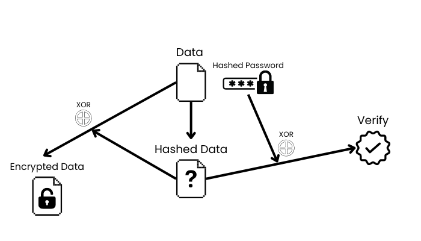

# excrypt.js

Super easy and secure encryption library.  
It improves on the weakness of conventional XOR ciphers, making them dramatically faster and easier.

This is the method I invented. Therefore, I cannot guarantee its safety 100%, but it is theoretically safe.

This encryption scheme is based on the trust that the sha256 hash will not be deconverted.  
Therefore, I recommend that passwords be at least a meaningless sequence of 6 digits.

Author: [@EdamAme-x](https://twitter.com/amex2189)

## Installation and Usage

```bash
npx jsr add @evex/excryptjs
bunx --bun jsr install @evex/excryptjs
deno add @evex/excryptjs
```

```ts
import { encrypt, decrypt } from "@evex/excryptjs";

const message = "Hello, world!"; // or Uint8Array
const password = "secret"; // or Uint8Array

const encrypted = await encrypt(message, password); // eTo3txn8WLNU+Kxib3teP7pdz7az8+P0XbLexjz1xsz/KJOyQouEUPzSVOud.AIzhDXcVEKQm7VuxoNVeANhSBMZLXI3+3Ffm6A/x5X0=

const decrypted = await decrypt(encrypted, password); // Hello, world!

// tips
const decrypted = await decrypt(encrypted, password, {
  parseString: false,
}); // Uint8Array of "Hello, world!"

const encrypted = await encrypt(message, password, {
  salt: "safe_salt",
  stretching: 2 ** 10,
}); // Options of Hash

const decrypted = await decrypt(encrypted, password, {
  salt: "safe_salt",
  stretching: 2 ** 10,
}); // Options of Hash
```

## How to encrypt?

Calculate the SHA-256 hash of the data and the password.  
The verify is the XOR of the hashed data and the hashed password.  
The encrypted data is the XOR of the hashed data and the data.


